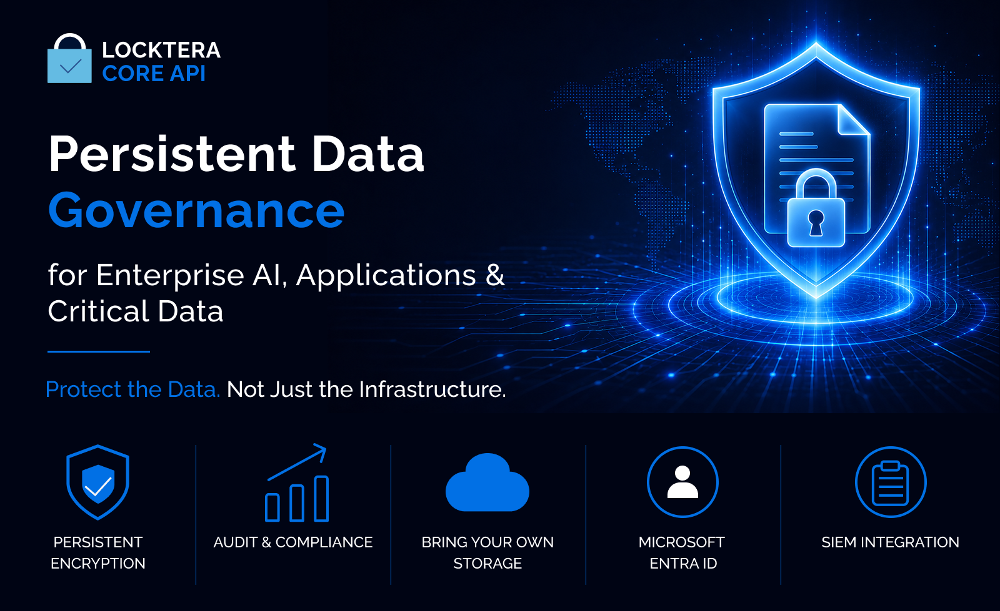
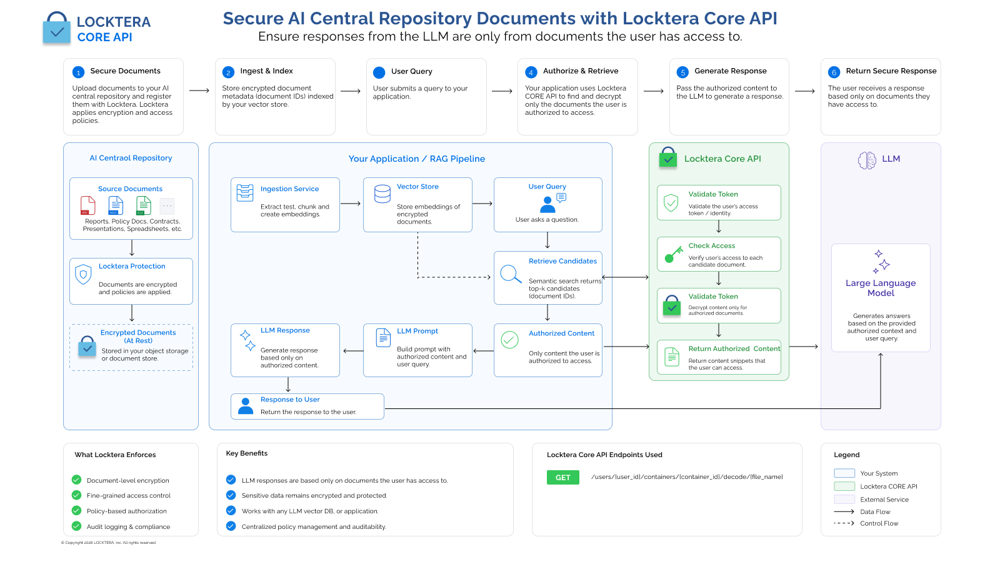
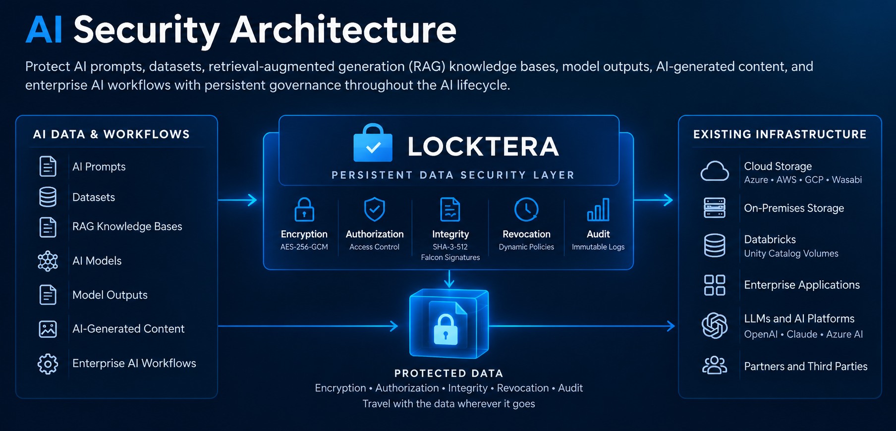
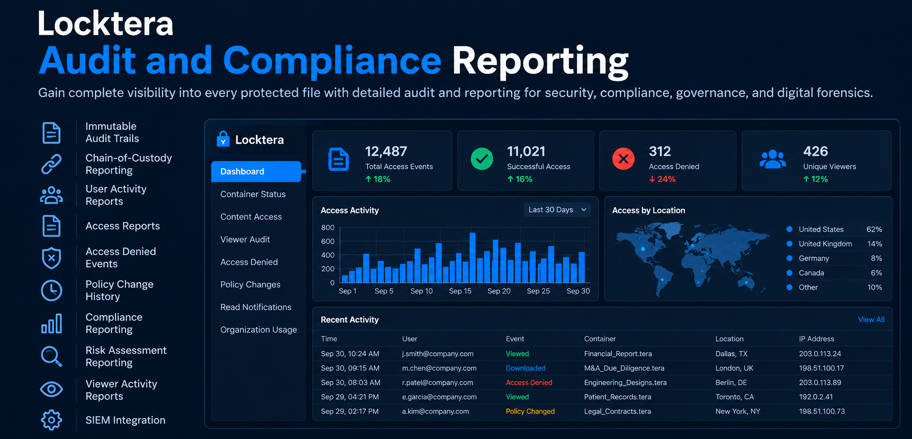
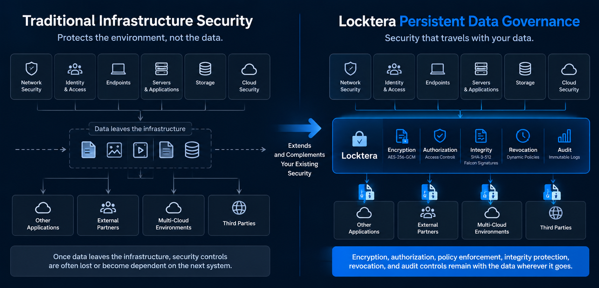

  

# Locktera

## Build Persistent Data Security Into Your Application

Protect files, AI models, RAG data, and sensitive application data with APIs and SDKs for encryption, authorization, integrity verification, revocation, and audit.

**Security that travels with your data—not just the system storing it.**

[API Documentation](https://docs.locktera.com/api-documentation/get-started) •
[Quick Start](https://docs.locktera.com/api-documentation/guides/core-file-security/) •
[Free Developer Trial](https://share.locktera.com/#/trial) •
[API Reference](https://docs.locktera.com/api-documentation/reference) •
[Architecture Guides](https://docs.locktera.com/api-documentation/guides/architecture-guides/) •
[Website](https://locktera.com)

---

## Start Building

**[Getting Started](https://docs.locktera.com/api-documentation/get-started)**  
Set up your development environment and make your first Locktera API call.

**[API Reference](https://docs.locktera.com/api-documentation/reference)**  
Explore authentication, endpoints, policies, and API operations.

**[Core File Security Quickstart](https://docs.locktera.com/api-documentation/guides/core-file-security/)**  
Protect a file and apply persistent access controls.

**[Free Developer Trial](https://share.locktera.com/#/trial)**  
Create an account and start testing Locktera CORE.

**Base API URL**

`https://api.locktera.com/api/v1`

---

# Locktera CORE Platform Architecture

Locktera CORE enables developers to add persistent data security directly to applications, AI workflows, storage platforms, and data pipelines.

Rather than relying only on the security of the system currently storing or processing the data, Locktera applies security controls directly to protected data so those controls can persist as the data moves across applications, storage environments, cloud platforms, AI workflows, and organizational boundaries.

  

---

## Core Security Capabilities

### Data Protection

- AES-256-GCM authenticated encryption
- SHA-3-512 integrity protection
- Falcon post-quantum digital signatures
- Persistent file-level security
- Revocable access
- Time-based access policies
- Recipient and role-based authorization
- Programmable policy enforcement
- Immutable protected containers

### Identity & Access

- Microsoft Entra ID integration
- OAuth 2.0 authentication
- SAML 2.0 Single Sign-On (SSO)
- Role-Based Access Control (RBAC)
- Organization, user, role, group, and recipient-level policies
- Time-based access controls
- IP and network-based access policies
- Geographic access policies
- Revocation at the protected-object or recipient level

### Storage & Deployment

- Bring Your Own Storage (BYOS)
- Microsoft Azure Blob Storage
- Amazon S3 and S3-compatible storage
- Google Cloud Storage
- Wasabi
- Akamai NetStorage
- Hybrid deployments
- On-premises deployments
- Multi-cloud architectures

### Security Operations

- Immutable audit trails
- Chain-of-custody reporting
- Access and viewer activity
- Access denied events
- Policy and authorization changes
- Download and usage activity
- SIEM integration
- Security and compliance reporting

---

# AI Security

Locktera protects AI models, datasets, RAG knowledge bases, retrieved content, prompts, outputs, and other AI artifacts with persistent data-level security.

Security controls remain associated with protected data as it moves through AI pipelines, applications, storage environments, and downstream systems.

  

### AI Model Security

Protect model artifacts from unauthorized access, modification, replacement, or distribution.

Apply persistent encryption, authorization, integrity verification, revocation, and audit controls directly to protected AI model files.

### Secure RAG & Enterprise AI

Protect datasets, RAG knowledge bases, retrieved enterprise data, prompts, model outputs, and AI-generated content.

Control access to protected enterprise data before it is released into downstream AI workflows while maintaining authorization and auditability around sensitive retrieved content.

---

# What You Can Build

### Secure AI & RAG

Protect models, datasets, RAG knowledge bases, retrieved content, prompts, outputs, and other sensitive AI artifacts.

### Secure Applications

Add persistent encryption, authorization, integrity verification, revocation, and audit controls to sensitive application data.

### Protected Data Exchange

Maintain security controls as sensitive data moves between users, applications, organizations, and cloud environments.

### Secure Storage & Data Pipelines

Protect sensitive data across cloud storage, archives, backup environments, AI pipelines, analytics platforms, and enterprise workflows.

### Digital Evidence & Chain of Custody

Protect surveillance video, investigation files, digital evidence, and other sensitive records while maintaining access history and chain-of-custody reporting.

---

# Audit & Compliance Reporting

Locktera provides visibility into how protected data is accessed and used across applications, users, and systems.

### Reporting Capabilities

- Immutable audit trails
- Chain-of-custody reporting
- User and viewer activity
- Access granted and denied events
- Policy and authorization changes
- Download and usage activity
- SIEM integration
- Security and compliance reporting

  

---

# Infrastructure Security + Persistent Data Security

Infrastructure security protects networks, identities, endpoints, applications, servers, and storage.

Locktera complements these controls by applying persistent security directly to protected data.

Encryption, authorization, policy enforcement, integrity protection, revocation, and audit controls can remain associated with protected data as it moves across applications, storage environments, cloud platforms, AI workflows, and organizational boundaries.

  

---

# Developer Resources

| Resource | Description |
|----------|-------------|
| **[Getting Started](https://docs.locktera.com/api-documentation/get-started)** | Set up your development environment and make your first API call. |
| **[API Reference](https://docs.locktera.com/api-documentation/reference)** | Explore Locktera CORE endpoints, authentication, policies, and API operations. |
| **[Free Developer Trial](https://share.locktera.com/#/trial)** | Evaluate Locktera CORE in a hosted developer environment. |
| **[Core File Security](https://docs.locktera.com/api-documentation/guides/core-file-security/)** | Protect files with persistent encryption, access control, and governance. |
| **[Infrastructure Security](https://docs.locktera.com/api-documentation/guides/infrastructure-security/)** | Learn how Locktera complements traditional infrastructure security. |
| **[Enterprise Architecture](https://docs.locktera.com/api-documentation/guides/enterprise-architecture/)** | Explore enterprise deployment patterns and reference architectures. |
| **[Architecture Guides](https://docs.locktera.com/api-documentation/guides/architecture-guides/)** | Review integration architectures and deployment scenarios. |
| **[Securing AI with Locktera](https://docs.locktera.com/api-documentation/guides/securing-ai-systems-with-locktera/)** | Protect AI models, datasets, RAG knowledge bases, prompts, and model outputs with persistent data security. |

---

# Get Started in 5 Minutes

1. **Create a free developer account** using the [Locktera Developer Trial](https://share.locktera.com/#/trial).
2. **Generate an API key** for your development environment.
3. **Authenticate** with the Locktera CORE API.
4. **Protect your first file** and apply an access policy.
5. **Review access and audit activity** for the protected object.

**Base API URL**

`https://api.locktera.com/api/v1`

[View the Getting Started Guide →](https://docs.locktera.com/api-documentation/get-started)

---

## SDKs

Locktera CORE can be integrated through REST APIs and enterprise SDKs.

SDKs are available for supported enterprise integrations and approved technology partners.

For SDK access or integration assistance, contact **sales@locktera.com**.

---

## Pricing & Licensing

Locktera CORE is commercial enterprise software with free developer trial access available for evaluation and integration testing.

[View Pricing & Licensing →](https://locktera.com/plans-and-pricing/)

[Start a Free Developer Trial →](https://share.locktera.com/#/trial)

---

## Build With Locktera

Locktera works with ISVs, SaaS platforms, AI companies, cybersecurity vendors, healthcare technology providers, storage platforms, and enterprise software companies to embed persistent data security into applications and workflows.

For technology partnerships, integrations, or SDK access, contact **sales@locktera.com**.

---

## Connect

**[Website](https://locktera.com)** •
**[Developer Documentation](https://docs.locktera.com)** •
**[Free Developer Trial](https://share.locktera.com/#/trial)** •
**[Pricing](https://locktera.com/plans-and-pricing/)**

Questions about integrations or enterprise deployments: **sales@locktera.com**
